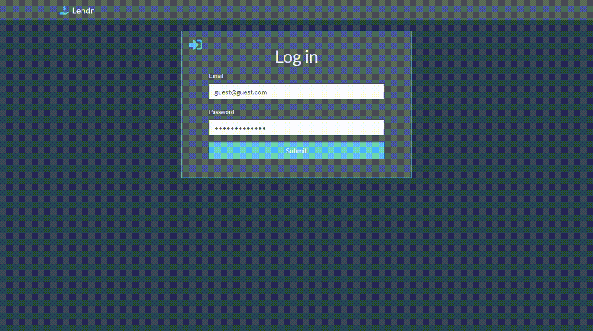

# Lendr

[Progressive Web App](https://developers.google.com/web/progressive-web-apps/) for keeping track of the money you lend on [Firestore](https://firebase.google.com/docs/firestore/). Uses service workers to allow saving to mobile device home screen or [desktop](https://developers.google.com/web/progressive-web-apps/desktop) for faster access and improved performance.

  

